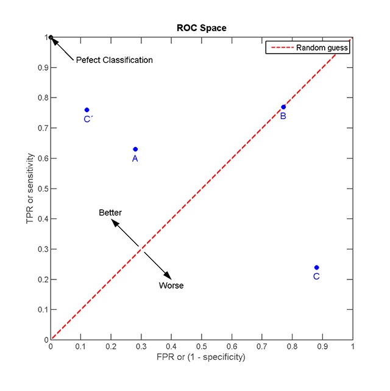

#Notes on classification tasks#

##Measures for assessing model performance

###Confusion table

| Class                        | Predictied positive  | Predicted negative      |
|--------------  --|:----------------|:-----------------|
| **Actual positive**   | True positive (_TP_) | False negative (_FN_)  |
|  **Actual negative** | False positive (_FP_) | True negative (_TN_) |

###Derived measures

[gimmick: math]()

**Accuracy** $$ ACC = \frac{TP + TN}{TP + TN + FP + FN} $$
**Balanced accuracy** $$ bACC = \frac{0.5\*TP}{TP + FN} + \frac{0.5\*TN}{TN + FP} = \frac{SEN + SPC}{2}$$
**F1-measure** $$ F1= \frac{2\*TP}{2\*TP + FP+ FN}$$
**Matthews correlation coefficient (MCC)** $$ MCC = \frac{TP \* TN - FP \* FN}{\sqrt{(TP + FP)(TP + FN)(TN + FP)(TN + FN)}} $$
**Sensitivity / True positive rate** $$ SEN= \frac{TP}{TP + FN} $$
**False positive rate** $$FPR= \frac{FP}{FP + TN}$$
**Specificity / True negative rate** $$ SPC= \frac{TN}{TN + FP} = 1 - FPR$$
**Positive predicted value (PPV)** $$PPV = \frac{TP}{TP + FP}$$
**False discovery rate (FDR)** $$ FDR = \frac{FP}{FP + TP} = 1 - PPV$$

###ROC - curve

Picture from: [https://en.wikipedia.org/wiki/Receiver_operating_characteristic](https://en.wikipedia.org/wiki/Receiver_operating_characteristic)

**_FILE: tutorial_classification.md - Sebastian Schmeier - Last update: 2013/12/13_**
