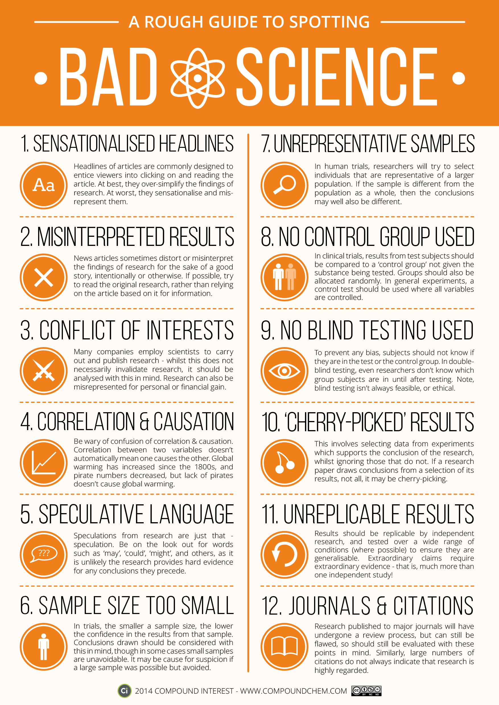

#Guide to spotting bad science

Here is a helpfull graphic provided by the folks at [Compound Interest](http://www.compoundchem.com/) to help you spot bad science [[1]]:

[1]: http://www.compoundchem.com/2014/04/02/a-rough-guide-to-spotting-bad-science/ "A Rough Guide to Spotting Bad Science. Compound Interest"
##References
1. [A Rough Guide to Spotting Bad Science. Compound Interest] [1]
