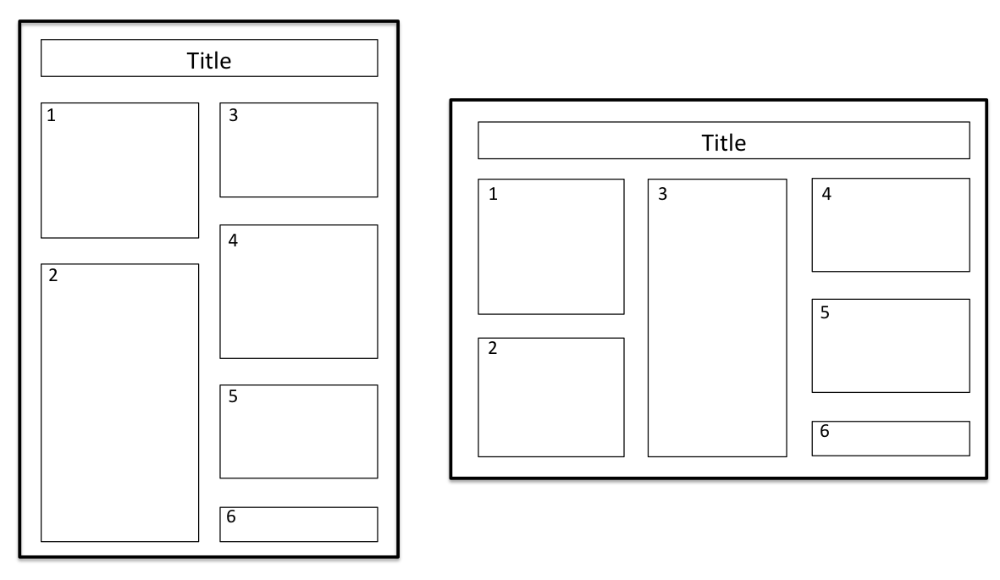

#Guide to preparing good research posters

##Introduction

Posters are a good tool to present ones research in a visual fashion. As such it is quite differnt from a written document, e.g. a journal article. To begin with, there is a good 2-page article on poster preparation here: 10 simple rules for creating a good poster presentation [[1]].

##The most important considerations
* The aim of a poster is to generate interest and a discussion about the chosen research topic.
* **Simplicity is key.**
* You will not be able to describe your research in great detail, thus chose to present the most important parts.
* Keep text brief. One should be able to "scan" through the poster and catch the most important ideas quickly.
* You can follow the same content strategy as with a journal article: Introduction, Methods, Results, Discussion, Future work, References. The "Methods" part can also be put at the end.
* If your poster is not about a new method, keep the methodology parts short. Technicalities can be discussed while presenting the poster.
* It is more important to have good graphics than lots of text elements, as images and graphs attract attention, whereas huge blocks of text scare people away.

##Visual design recommendations
* The first element to create attention is a banner with poster title, name, and department or class, if applicable). The banner should be positioned at top-center of the poster. It is the first element to create attention, so choose your title wisely.
* It has to be obvious to the viewer of the poster how to view the poster in an ordered fashion. The flow of a poster should be top-to-bottom and left-to-right. See Figure 1 for the general flow of information on a poster.
* Use open space around the individual elements as this is less tiring to the eye and mind.
* You can chose to use a border around individual elements if this helps the presentation.
* Limit the amounts of colours used on the poster. Use colours that are pleasing to the eye, and avoid very bright colours. Also, think about people with red-green color vision deficiency.

Figure 1: Poster design examples and flow of information.

##Graphics
* Mix text elements with graphics to counter act the "monotony" (don't read as boredom) of the text.
* If possible present tabular data in form of a graphic (e.g. histogram, etc.). If data must be presented in table-form, keep it simple.
* Make sure that any visual element can "stand alone" (e.g. have short informative figure titles, graph axes should be labeled properly, etc.).
* Information on how to prepare a good chart for your data can be found [here](general_chart.md).

##Font matters
* Use big enough fonts for the text elements. Text on the poster must be readable from a distance of a metre.
* As a rule you should have a font not smaller than 28pt.
* The title should be size 70pt.
* Sub-titles 54pt

[1]: http://www.ncbi.nlm.nih.gov/pmc/articles/PMC1876493/ "10 simple rules for creating a good poster presentation. Erren TC and Bourne PE. PLoS Comput Biol. May 2007; 3(5): e102."
 
##References
1. [10 simple rules for creating a good poster presentation. Erren TC and Bourne PE. PLoS Comput Biol. May 2007; 3(5): e102.] [1]
